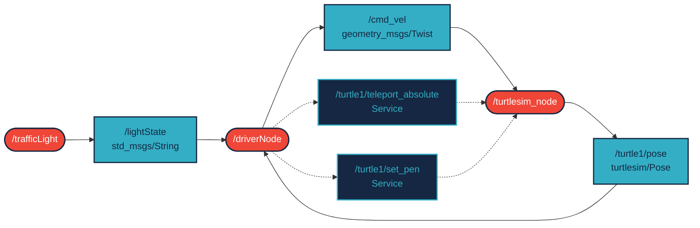

# may_nev_ajr package
ROS 2 C++ package.  [](https://docs.ros.org/en/humble/)

## Leírás
A package kettő node-ból áll.
A `/trafficLight` node egy közlekedési lámpát szimulál, amely hasonlóan váltja az állapotát, mint a valóságban.

A `/driver` node egy autonóm járművet (teknőst) vezérel, mely a lámpa állapotához igazítja a sebességét:
- Ha zöld a lámpa, akkor teljes sebességgel halad
- Ha zöld után vált sárgára a lámpa, akkor lassít
- Ha piros a lámpa, akkor megáll
- Ha piros után sárga a lámpa, akkor elkezd gyorsítani

A teknős a megadott pontokon automatikusan megfordul és folytatja a mozgását.

ROS2 Humble alatt minden futtatható.

## Packages and build

It is assumed that the workspace is `~/ros2_ws/`.

### Clone the packages
``` r
cd ~/ros2_ws/src
```
``` r
git clone https://github.com/AstruntCM/may_nev_ajr.git
```

### Build ROS 2 packages
``` r
cd ~/ros2_ws
```
``` r

colcon build --packages-select may_nev_ajr --symlink-install
```

<details>
<summary> Don't forget to source before ROS commands.</summary>

``` bash
source ~/ros2_ws/install/setup.bash
```
</details>

``` r
ros2 launch may_nev_ajr launch_example1.launch.py
```

### Graph


